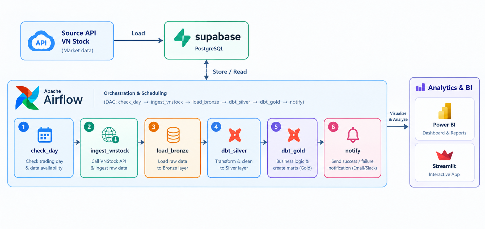

# VNStock ELT Pipeline

Pipeline ELT cho dữ liệu chứng khoán Việt Nam: gọi các API công khai của **Vietcap (VCI)** và **KB Securities (KBS)**, nạp thẳng dữ liệu thô vào schema `bronze` trên **Supabase (PostgreSQL)**, rồi dùng **dbt** dựng các tầng Silver và Gold.



## Cài đặt

```powershell
python -m venv .venv
.venv\Scripts\Activate.ps1
python -m pip install -r requirements.txt
```

Tạo file `.env` ở thư mục gốc (file này không được commit):

```dotenv
DATABASE_URL=postgresql://postgres:<password>@db.<project-ref>.supabase.co:5432/postgres
PGHOST=db.<project-ref>.supabase.co
PGPORT=5432
PGUSER=postgres
PGPASSWORD=<password>
PGDATABASE=postgres
VNSTOCK_SOURCE=VCI
STOCK_SYMBOLS=VCB,FPT,HPG,VNM
START_DATE=2024-01-01
```

## Nạp dữ liệu vào Bronze

Không có file trung gian: dữ liệu từ API được ghi thẳng vào các bảng `bronze.*`. Loader tự tạo schema và bảng khi chạy lần đầu.

```powershell
python run_pipeline.py run --mock          # chạy thử với dữ liệu mẫu, không gọi API, không ghi DB
python run_pipeline.py run                 # VCI/KBS API -> Supabase bronze
python run_pipeline.py run --full-refresh  # lấy lại toàn bộ giá từ START_DATE
python run_pipeline.py check-day           # hôm nay có phải phiên giao dịch và đã có dữ liệu chưa
```

- **Nạp tăng dần (incremental):** giá chỉ được lấy từ ngày mới nhất đã có trong Bronze lùi lại 5 ngày, để bắt kịp các lần nguồn sửa dữ liệu. Chạy lần đầu thì lấy từ `START_DATE`.
- Mỗi dòng Bronze có `ingestion_date`, `extracted_at` và `batch_id` (run id của Airflow) để truy vết.

## Điều phối bằng Airflow

DAG `vnstock_elt` ([dags/vnstock_elt_dag.py](dags/vnstock_elt_dag.py)) chạy lúc **15:30 các ngày thứ 2 đến thứ 6** (giờ VN), sau khi phiên ATC đóng cửa:

| Task | Việc làm |
|---|---|
| `check_day` | Bỏ qua cuối tuần. Với ngày thường, kiểm tra đã có nến ngày của mã đầu tiên chưa, nên tự nhận biết ngày lễ mà không cần lịch nghỉ. Không phải ngày giao dịch thì cả run được đánh dấu *skipped*, không phải *failed* |
| `ingest_vnstock` | Gọi API VCI/KBS (giá lấy incremental) và lưu tạm vào `/tmp` trong container |
| `load_bronze` | Append vào `bronze.*` trên Supabase, gắn `batch_id` = `run_id`, xoá file tạm |
| `dbt_silver` | `dbt build` cho test nguồn Bronze, các model Silver và test của chúng |
| `dbt_gold` | `dbt build` cho các model Gold và test |
| `notify` | Luôn chạy (`all_done`): gửi thông báo thành công, bỏ qua hoặc thất bại qua Slack/Email. Nếu có task lỗi thì notify cũng fail để run được đánh dấu failed |

```powershell
docker compose up -d --build     # http://localhost:8081  (user: admin, mật khẩu: AIRFLOW_ADMIN_PASSWORD, mặc định admin)
docker compose logs -f airflow
docker compose down
```

- Airflow chạy một container duy nhất (`airflow standalone`). Các thư viện của pipeline và dbt nằm trong một virtualenv riêng (`/opt/pipeline-venv`) để không xung đột dependency với Airflow.
- **Kết nối Supabase từ Docker:** host `db.<ref>.supabase.co` chỉ có IPv6, mà Docker Desktop không đi ra được IPv6. Vì vậy container dùng **Session Pooler** (IPv4). Thêm vào `.env`:
  ```dotenv
  SUPABASE_POOLER_HOST=aws-0-<region>.pooler.supabase.com
  SUPABASE_POOLER_USER=postgres.<project-ref>
  ```
  Giá trị lấy ở Supabase Dashboard → Connect → Session pooler.
- **Thông báo** (không bắt buộc, thêm vào `.env`): `SLACK_WEBHOOK_URL`, hoặc `SMTP_HOST`, `SMTP_PORT`, `SMTP_USER`, `SMTP_PASSWORD`, `NOTIFY_EMAIL_TO` (Gmail thì dùng App Password). Nếu không cấu hình thì thông báo chỉ được ghi vào log của task.
- **Chạy tay / backfill:** vào *Trigger DAG w/ config*, truyền `{"force": true}` để bỏ qua bước kiểm tra ngày, hoặc `{"full_refresh": true}` để lấy lại toàn bộ giá từ `START_DATE`.
- Port 8081 được chọn để không đụng Airflow của project khác đang dùng 8080. Có thể đổi bằng biến `AIRFLOW_PORT`.

### Dự phòng trên cloud: GitHub Actions

Airflow chạy trên máy cá nhân nên máy phải bật lúc 15:30. Workflow [.github/workflows/daily-elt.yml](.github/workflows/daily-elt.yml) chạy **cùng các bước lúc 16:00** các ngày thứ 2 đến thứ 6, kể cả khi máy tắt. Nếu Airflow đã chạy rồi thì chạy lại cũng không sao, vì Silver giữ bản mới nhất cho mỗi khoá và Gold được build lại từ Silver.

Thêm secrets ở GitHub → **Settings → Secrets and variables → Actions**. Runner của GitHub không có IPv6 nên phải dùng Session Pooler:

| Secret | Giá trị |
|---|---|
| `SUPABASE_POOLER_HOST` | `aws-0-<region>.pooler.supabase.com` |
| `SUPABASE_POOLER_USER` | `postgres.<project-ref>` |
| `PGPASSWORD` | mật khẩu database |
| `SLACK_WEBHOOK_URL`, `SMTP_*`, `NOTIFY_EMAIL_TO` | không bắt buộc |

Chạy tay: tab **Actions → Daily ELT → Run workflow**, có 2 tuỳ chọn `force` và `full_refresh`.

## Analytics & BI

**Streamlit** ([app/streamlit_app.py](app/streamlit_app.py)) đọc tầng Gold và có 4 tab: giá và hiệu suất tương đối, định giá P/E và P/B theo ngày, tài chính theo quý, khối ngoại.

```powershell
pip install -r app/requirements.txt
streamlit run app/streamlit_app.py      # đọc DATABASE_URL từ .env
```

Khi deploy lên Streamlit Community Cloud, đặt `DATABASE_URL` trong *Secrets* và dùng chuỗi kết nối Session Pooler (IPv4).

**Power BI:** xem [docs/powerbi.md](docs/powerbi.md), gồm cách kết nối, các quan hệ trong mô hình, measure DAX và gợi ý các trang báo cáo.

## Chạy dbt

Profile dbt đọc các biến `PGHOST`, `PGUSER`, `PGPASSWORD`, `PGPORT` và `PGDATABASE` từ environment. Trên PowerShell, nạp chúng từ `.env` trước khi chạy dbt:

```powershell
Get-Content .env | Where-Object { $_ -match '^\s*([^#][^=]*)=(.*)$' } | ForEach-Object { Set-Item "env:$($Matches[1].Trim())" $Matches[2].Trim() }
dbt debug --project-dir dbt --profiles-dir dbt
dbt build --project-dir dbt --profiles-dir dbt
```

`sources.yml` đọc các bảng raw trong schema `bronze`; Silver tạo staging views và Gold tạo dimensions, facts cùng market summary.

## Nguồn dữ liệu và lưu ý

Pipeline gọi thẳng các API JSON công khai mà trang web của Vietcap và KBS đang dùng, qua [src/market_client.py](src/market_client.py). Dự án **không dùng `vnstock`/`vnai`** nữa: ngày 24/09/2026 PyPI đã cách ly hai gói này để rà soát bảo mật, và `vnai` tự ghi file "lệnh cho AI agent" vào `~/.claude/CLAUDE.md`, `~/.codex/AGENTS.md` và thư mục project.

| Bảng Bronze | Endpoint | Ghi chú |
|---|---|---|
| `companies_raw` | VCI IQ `company/details` + bảng giá KBS | Loại công ty (`is_bank`), sàn, số cổ phiếu, % sở hữu nước ngoài và room (chỉ có giá trị hiện tại) |
| `historical_prices_raw` | VCI `chart/OHLCChart/gap-chart` | Giá **đã điều chỉnh**, đơn vị **nghìn đồng** (65.18 = 65.180 đ) |
| `financial_statements_raw` | VCI IQ `financial-statement` + `statistics-financial` | Toàn bộ lịch sử theo quý từ 2018, kèm **ngày công bố thật** (`public_date`). Có P/E, P/B, ROE, ROA, D/E, vốn hoá, và NIM/NPL/CASA cho ngân hàng |
| `foreign_trading_raw` | KBS `stock/iss` (bảng giá) | Mua/bán và room của khối ngoại trong phiên hiện tại |

- Đây là các API **không chính thức**: định dạng có thể thay đổi, nên client kiểm tra từng trường nó cần và báo lỗi ngay thay vì âm thầm nạp dữ liệu sai. Client có retry và nghỉ 0,5 giây giữa các request để không gây tải cho nguồn.
- **Khối ngoại:** không có nguồn miễn phí nào cho lịch sử, nên pipeline chụp bảng giá mỗi lần chạy và tích luỹ dần. Lịch sử chỉ bắt đầu từ ngày chạy đầu tiên, các ngày trước đó để `NULL`. Nên chạy **sau 15:00**. Với giai đoạn trước đó, dùng `dim_companies.foreign_ownership_pct` và `foreign_room_pct` thay thế.
- **Tránh look-ahead bias:** khi nối BCTC với giá, hãy nối theo `available_date` (ngày công bố thật, hoặc cuối quý + 45 ngày nếu không có), không nối theo `quarter_end_date`. Ví dụ: BCTC quý 2/2026 của HPG được công bố ngày 03/09, muộn 3 tuần so với ước lượng +45 ngày.
- **Lợi nhuận:** `profit_parent` là LNST thuộc cổ đông công ty mẹ, được dùng cho TTM và tăng trưởng YoY. `profit` là LNST tổng, gồm cả phần của cổ đông thiểu số.
- **Ngân hàng** (`is_bank = true`): `revenue` là tổng thu nhập hoạt động, không phải doanh thu thuần, nên chỉ so sánh ngân hàng với ngân hàng.
- Bronze chỉ append, không ghi đè. Silver giữ bản trích xuất mới nhất cho mỗi khoá, còn loader tự thêm cột mới vào các bảng Bronze đã có.

## Test

```powershell
python -m pytest -q
```
